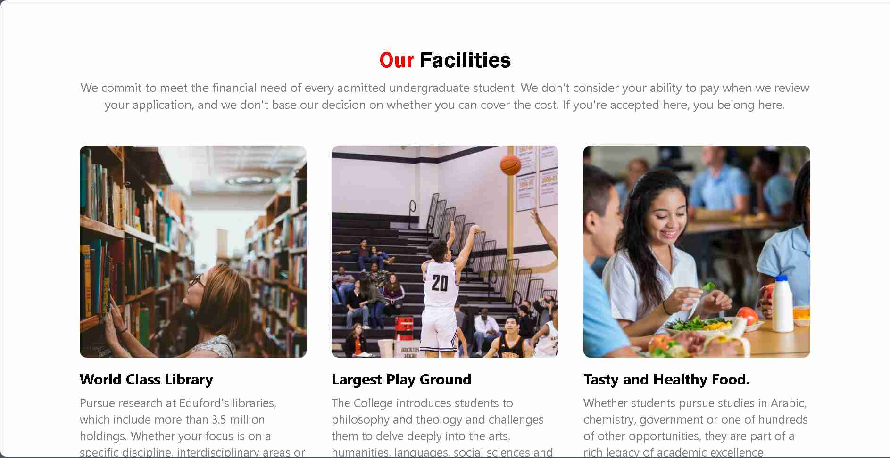
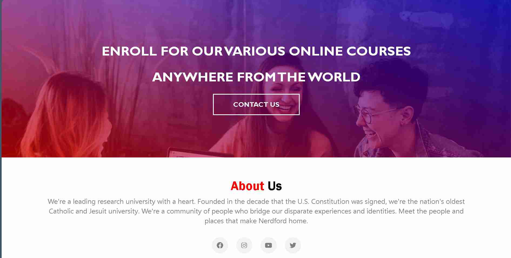

# School Website Template: NerdFord

[](LICENSE)

A professionally designed one-page school website template, perfect for showcasing courses, global campuses, facilities, testimonials, and contact details.

## Table of Contents
- [Overview](#overview)
- [Features](#features)
- [Preview](#preview)
- [Getting Started](#getting-started)
- [Usage](#usage)
- [Contributing](#contributing)
- [License](#license)
- [Contact](#contact)

## Overview

This project serves as a flexible template for creating modern one-page school websites. Designed with a clean and intuitive interface, it provides a foundation for schools, educational institutions, or developers looking to create an engaging online presence.

## Features

- **Responsive Design:** Seamlessly adapts to various devices, ensuring an optimal viewing experience for all users.
- **Engaging Sections:** From the captivating hero section to the informative courses and facilities sections, every aspect of the template is meticulously crafted to captivate and inform.
- **Student Testimonials:** Placeholder for real feedback, adding authenticity and credibility to your institution.
- **Contact:** Easy-to-use contact section for inquiries and feedback, fostering interaction and communication with your audience.
- **About Us:** An adaptable section for providing insight into your institution's mission, values, and commitment to excellence.

## Preview





For a closer look, check out the [live demo](https://okafor-chiagozie.github.io/NerdFord) or download the project and open the `index.html` file in your web browser.

## Getting Started
1. Clone the repository
   ```bash
   git clone https://github.com/Okafor-Chiagozie/NerdFord.git
   ```
2. Navigate to the project directory
   ```bash
   cd project-directory
   ```
3. Open the `index.html` file in your preferred web browser.
   
## Usage
Explore the various sections of the template to visualize how it can be customized to represent your school or educational institution. Whether you're creating a new website or revamping an existing one, this template provides a solid starting point.

## Contributing
- Fork the repository
- Create a new branch 
   ```bash
   git checkout -b feature/your-feature
   ```
- Make changes and commit 
   ```bash
   git commit -m 'Add some feature'
   ```
- Push to the branch 
   ```bash
   git push origin feature/your-feature
   ```
- Open a pull request

## License
This project is licensed under the MIT License - see the [LICENSE](LICENSE) file for details.

## Contact
Feel free to contact me at [ collincity111@gmail.com ] for any inquiries or feedback.